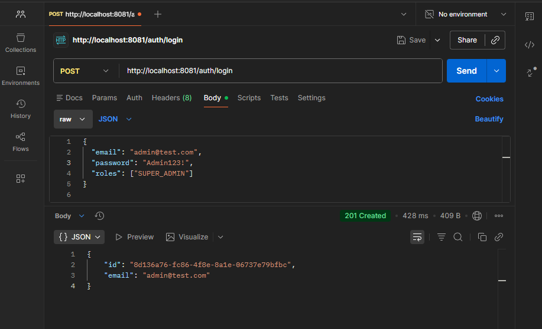
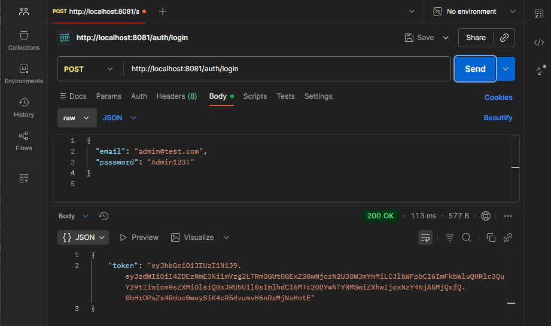

# Auth Service

Microservicio de autenticación para la plataforma e-commerce. Provee registro de usuarios y autenticación basada en JWT.

## Tecnologías

* Java 17+
* Spring Boot
* Spring Data JPA
* Spring Security (JWT)
* Maven
* Docker
* H2 (tests)

## Configuración

Variables principales en `application.yml`:

* **server.port**: puerto del servicio (8081)
* **security.jwt.secret**: clave secreta para firmar los JWT
* **security.jwt.expiration**: tiempo de expiración del token en ms

La base de datos productiva debe crearse de manera externa (por ejemplo PostgreSQL/MySQL). Para tests se usa H2 en memoria.

## Endpoints

### Registro de usuario

**POST** `/auth/register`

Request:

```json
{
  "email": "admin@test.com",
  "password": "Admin123!",
  "roles": ["SUPER_ADMIN"]
}
```

Response `201 Created`:

```json
{
  "id": "8d15a676-fc86-4f8e-8a1e-06737e79bfbc",
  "email": "admin@test.com"
}
```



---

### Login

**POST** `/auth/login`

Request:

```json
{
  "email": "admin@test.com",
  "password": "Admin123!"
}
```

Response `200 OK`:

```json
{
  "token": "<jwt-token>"
}
```



## Tests

* Tests unitarios con JUnit 5 y Mockito
* Sin dependencia de base de datos real
* Configuración en `application-test.yml`

## Docker

El Dockerfile se encuentra en el directorio `docker/`. El build debe ejecutarse desde la raíz del proyecto para que el JAR generado en `target/` sea accesible.

Ejemplo:

```bash
mvn clean package

docker build -f docker/Dockerfile -t auth-service .
```

## Estado

✅ Registro funcionando
✅ Login con JWT
✅ Tests unitarios
