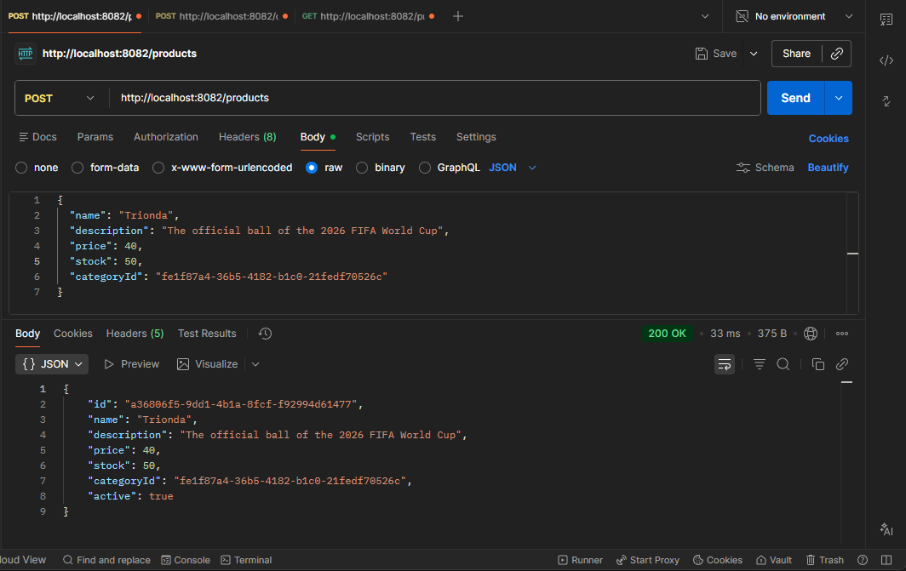
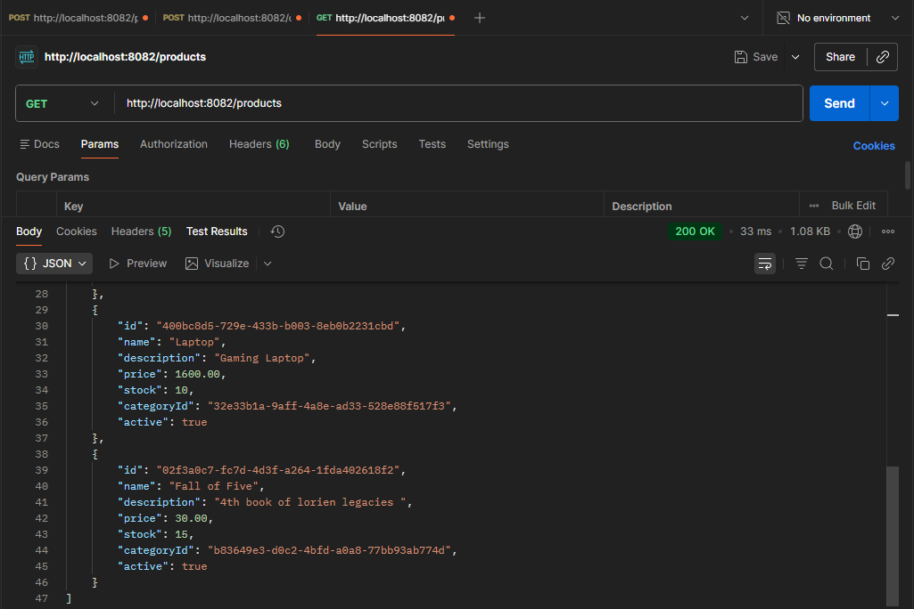

# Catalog Service

Microservicio de catálogo para la plataforma **E-Commerce Backend**.  
Es responsable de la gestión de productos y categorías, exponiendo una API REST y aplicando **Arquitectura Hexagonal (Ports & Adapters)** para mantener un dominio desacoplado de la infraestructura.

---

## Tecnologías

* Java 17+
* Spring Boot
* Spring Web
* Spring Data JPA
* Maven
* Docker
* PostgreSQL (producción)
* H2 (tests)
* JUnit 5
* Mockito

---

## Arquitectura

El servicio implementa **Arquitectura Hexagonal**, separando claramente:

* **Dominio**: entidades y reglas de negocio
* **Aplicación**: casos de uso
* **Adaptadores**: entrada (REST) y salida (persistencia)

Esto permite:
* Probar la lógica de negocio sin dependencias externas
* Cambiar la base de datos sin afectar el dominio
* Mantener un código limpio y escalable

---

## Estructura del Proyecto

    com.e_commerce.catalog_service
    │
    ├── adapter
    │ ├── in
    │ │ └── rest
    │ │ ├── dto
    │ │ │ ├── request
    │ │ │ └── response
    │ │ ├── CategoryController
    │ │ └── ProductController
    │ │
    │ └── out
    │ └── persistence
    │ ├── entity
    │ ├── mapper
    │ ├── repository
    │ ├── CategoryAdapter
    │ └── ProductAdapter
    │
    ├── application
    │ └── service
    │ ├── CategoryApplicationService
    │ └── ProductApplicationService
    │
    ├── domain
    │ ├── model
    │ │ ├── Category
    │ │ └── Product
    │ │
    │ └── port
    │ ├── in
    │ │ ├── CreateCategoryUseCase
    │ │ ├── UpdateCategoryUseCase
    │ │ ├── DeleteCategoryUseCase
    │ │ ├── ListCategoriesUseCase
    │ │ ├── CreateProductUseCase
    │ │ ├── UpdateProductUseCase
    │ │ ├── DeleteProductUseCase
    │ │ ├── GetProductUseCase
    │ │ ├── ListProductUseCase
    │ │ └── SearchProductUseCase
    │ │
    │ └── out
    │ ├── CategoryRepository
    │ └── ProductRepository
    │
    └── CatalogServiceApplication

---

## Configuración

Variables principales en `application.yml`:

```yaml
  spring:
    datasource:
      url: jdbc:postgresql://localhost:5432/catalog_db
      username: postgres
      password: postgresPassword
      driver-class-name: org.postgresql.Driver

    jpa:
      hibernate:
        ddl-auto: update
      show-sql: true
      properties:
        hibernate:
          format_sql: true
```

La base de datos productiva debe crearse externamente (PostgreSQL).  
Para tests se utiliza **H2 en memoria**.

---

## Endpoints

### Crear categoría

**POST** `/catalog/categories`

Request:

```json
{
  "name": "Electronics",
}
```
Response 201 Created:

```json
{
  "id": "b5f1a3c4-2f1b-4f7a-9f6e-9a2e6d9c1f44",
  "name": "Electronics",
  "active": true
}
```

### Listar categorías

**GET** `/catalog/categories`

Response 200 OK:


```json
[
    {
        "id": "32e33b1a-9aff-4a8e-ad33-528e88f517f3",
        "name": "Tech",
        "active": true
    },
    {
        "id": "b83649e3-d0c2-4bfd-a0a8-77bb93ab774d",
        "name": "Books",
        "active": true
    },
    {
        "id": "2473a39c-9339-45b3-b723-86c25afe83ed",
        "name": "Toys",
        "active": true
    }
]
```

### Crear producto

**POST** `/catalog/products`

📸 Screenshot Postman:




### Listar productos

**Get** `/catalog/products`

📸 Screenshot Postman:




## Tests

* Tests unitarios con JUnit 5 y Mockito
* Sin dependencia de base de datos real
* Configuración en `application-test.yml`

## Docker

El Dockerfile se encuentra en el directorio `docker/`. El build debe ejecutarse desde la raíz del proyecto para que el JAR generado en `target/` sea accesible.

Ejemplo:

```bash
mvn clean package

docker build -f docker/Dockerfile -t catalog-service .
```

## Estado

- ✅ CRUD de categorías
- ✅ CRUD de productos
- ✅ Arquitectura hexagonal aplicada
- ✅ Tests implementados
- ✅ Integrable con Auth Service

